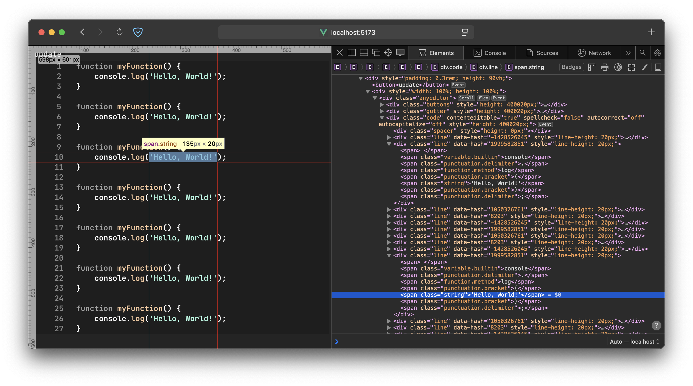

**anycode** is a web-based IDE that allows you to write, edit, and manage code directly from your browser. Anycode supports a wide range of programming languages and provides an intuitive interface with powerful features for a seamless development experience.

## Features
- **Custom editor component**: Very fast and higly optimized virtual rendering based on tree-sitter parser, providing best scrolling experience. 
- **Multi-language support**: Work with various programming languages in a single environment.
- **Advanced code experience**: Utilizes a custom code component based on **web-tree-sitter** for efficient parsing, syntax highlighting, and real-time code analysis.

## Contributing

We welcome contributions! Please fork the repository and submit a pull request with your changes. Make sure to follow the existing code style and include relevant tests.
